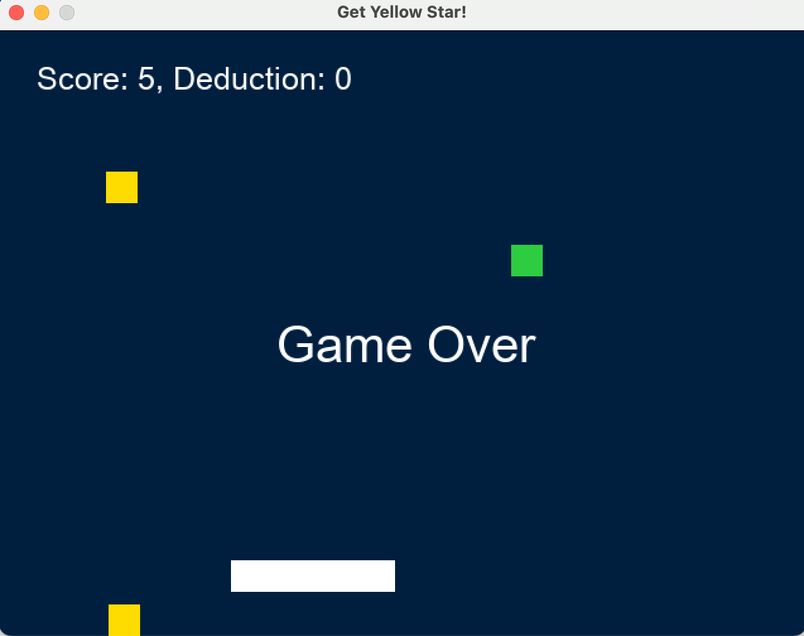

# Ruby2d Game: Shooting Star!

### Overview

Welcome to Shooting Star! Shooting Star is the game with one paddle, moving yellow stars, and mocing green stars. The goal is to collect as many yellow  stars as possible and avoid collecting green starts. 



### Prerequisite

To play the game, please make sure that you have installed ruby2d.

```bash
gem install ruby 2d
```

After you installed ruby2d, clone the source code to your local to begin the game!

```bash
git clone https://github.com/Michiru0206/Ruby2d-Game.git
```

### Description

## Author

## References

